## How to Run the Project

To run this project locally, you need Node.js and npm installed.

Clone the repository:
git clone https://github.com/AnithaGummalla/weather-app/

Go to the project folder:
cd weather-app

- Create a .env file in the root folder and add API key:
  VITE_WEATHER_API_KEY=api_key_here

- Install dependencies:
  npm install

- Start the server:
  npm run dev

Open http://localhost:5173 in your browser.

## Notes on Approach and Design Decisions

- The app fetches weather data only when the user clicks the button in the hero section to avoid unnecessary API calls and improve performance.

- On button click, it attempts to get the user's location via the browser's Geolocation API:

- If the user grants permission, the app fetches weather data using latitude and longitude.

- If the user denies permission or location is unavailable, the app falls back to fetching weather data for the default city ("Bangalore").

- This flow provides control to the user, allowing them to decide when to share location and see weather, improving privacy and UX.

- Weather fetching logic is split into two functions for clarity and maintainability: one handles fetching by coordinates, the other by city name.

- The floating weather card updates dynamically based on whichever data source is successful, ensuring a consistent UI experience.

- Error handling is implemented to inform users if the weather data cannot be retrieved.

## Weather API Details

- API Provider: [OpenWeatherMap](https://openweathermap.org/api)
- API Used: Current Weather Data (Free Tier)

- Base URL: https://api.openweathermap.org/data/2.5/weather

- Parameters Passed:
- If user grants location access:

  - `lat`: Latitude
  - `lon`: Longitude

- If user denies location access:

  - `q`: City name (default: "Bangalore")

- Common parameters:
- `appid`: 475d63f040b95df5190bbd0e5916ada9
- `units`: "metric"

- Example API calls:
- By city:  
  https://api.openweathermap.org/data/2.5/weather?q=Bangalore&units=metric&appid=API_KEY
- By coordinates:  
  https://api.openweathermap.org/data/2.5/weather?lat=12.97&lon=77.59&units=metric&appid=API_KEY

- The API returns temperature, city name, weather condition, and an icon code.

## screenshots

### Desktop View (1440px)

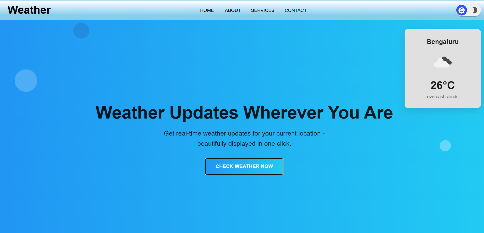
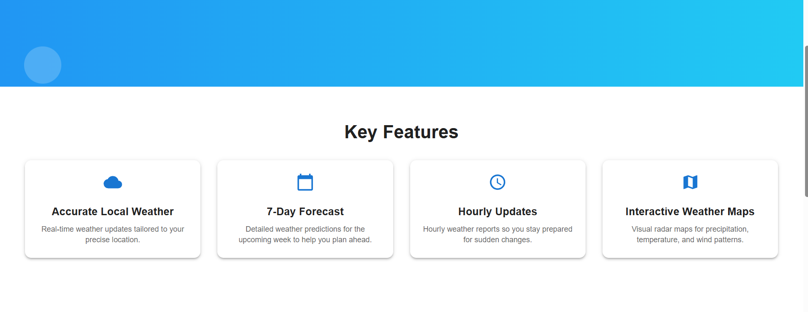
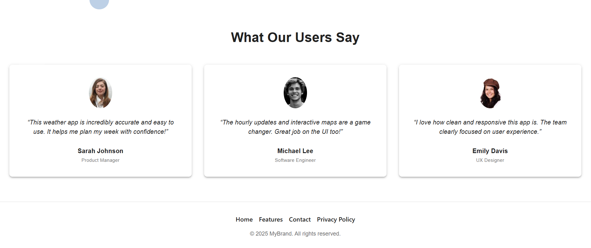

### Tablet View (768px)

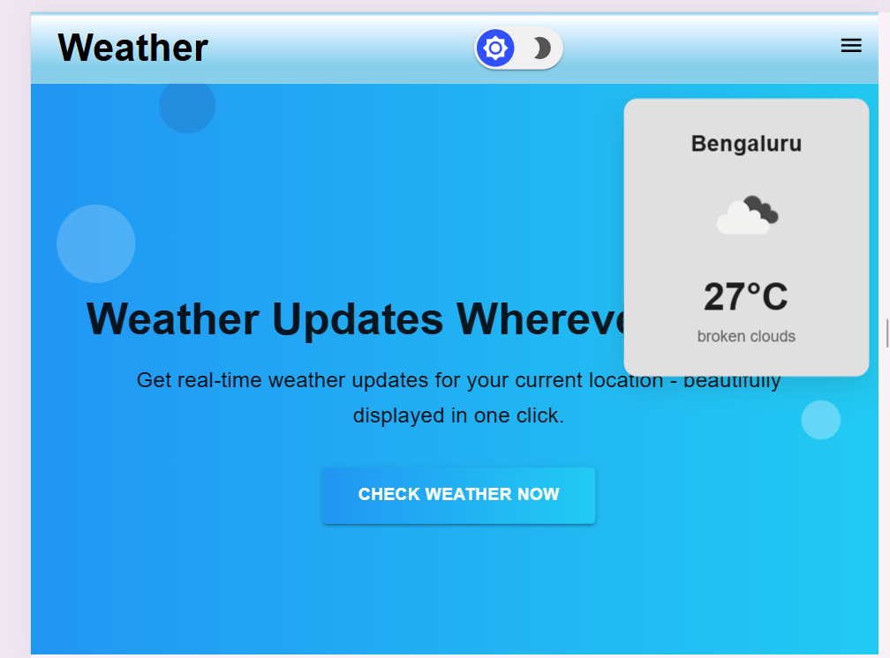
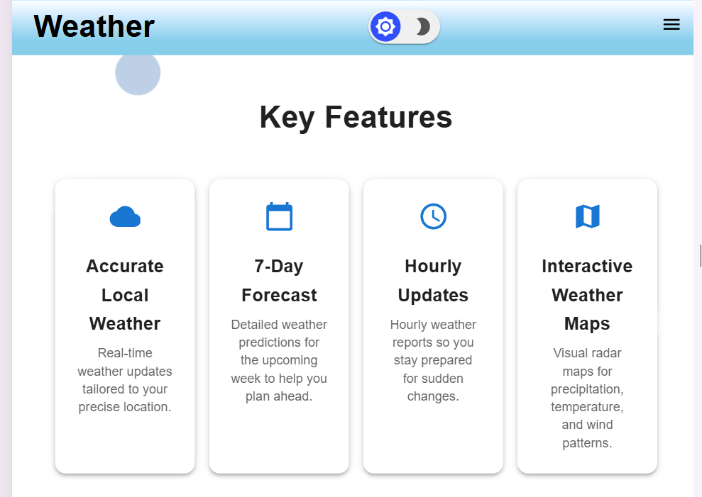
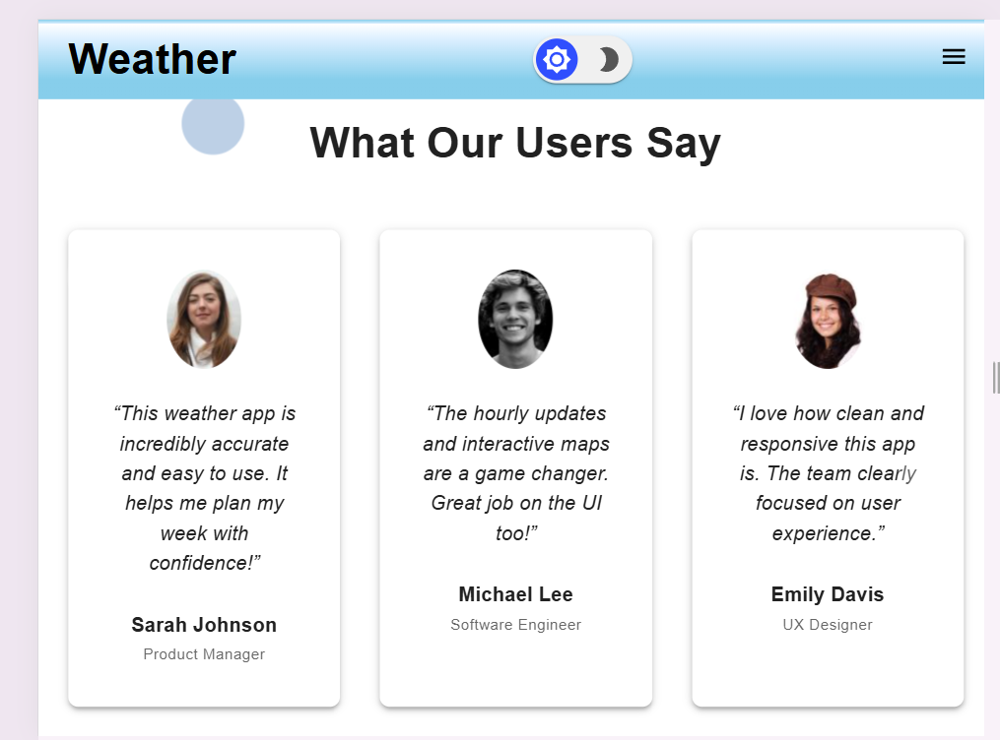
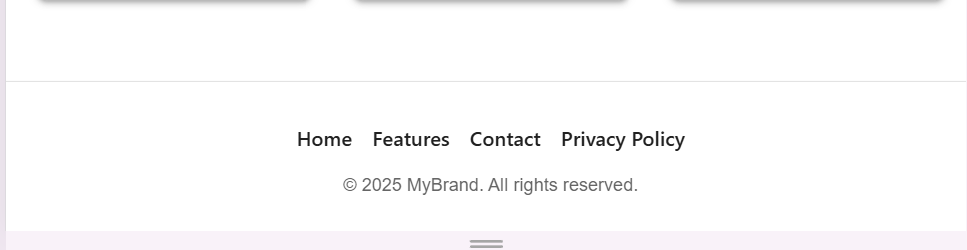

### Mobile View (375px)

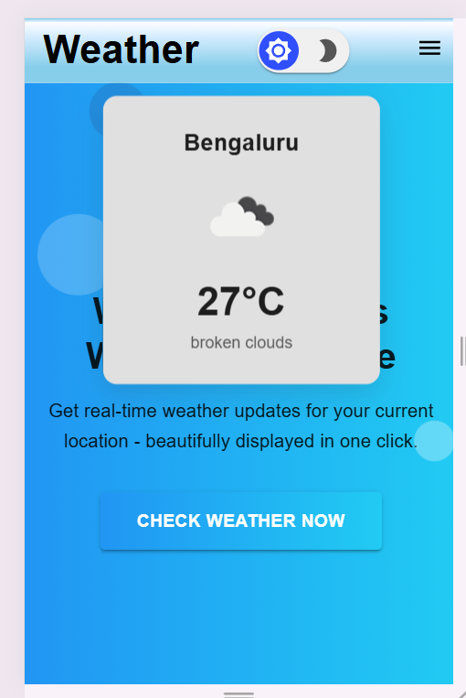
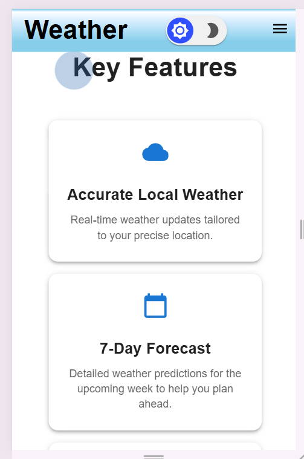
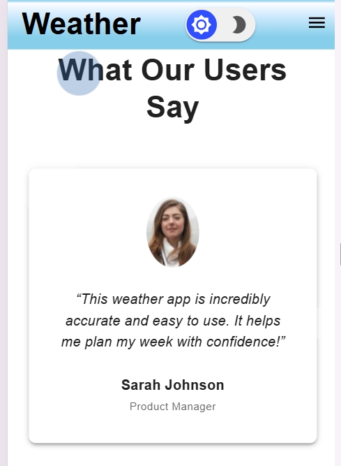
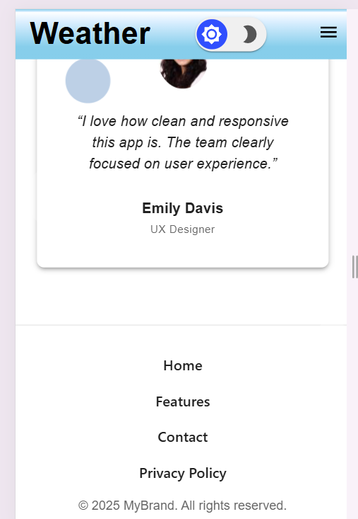

## 📝 Notes on Approach / Design Decisions

- **Component-Based Architecture**: The UI is built using reusable React components (`Navbar`, `HeroSection`, `FeatureHighlights`, `WeatherCard`, `Testimonials`, etc.) to keep the codebase modular and maintainable.

- **Material UI (MUI)**: Used MUI for styling and layout to ensure consistent design, responsiveness, and accessibility. Theming support was used to enable light and dark modes seamlessly.

- **Responsive Design**: Utilized MUI’s `useMediaQuery` hook and breakpoint system to adapt layouts for mobile, tablet, and desktop devices.

- **Floating Weather Card**: Integrated a real-time weather widget using the OpenWeatherMap API. It’s styled as a floating card that displays city, temperature, and weather icon based on user location or a fallback city.

- **Typography and Icons**: Leveraged MUI's typography variants and icon library to maintain visual hierarchy and clarity.

- **User-Centric Layout**: Prioritized content flow and readability in each section (e.g., testimonials, features) to enhance user experience.
